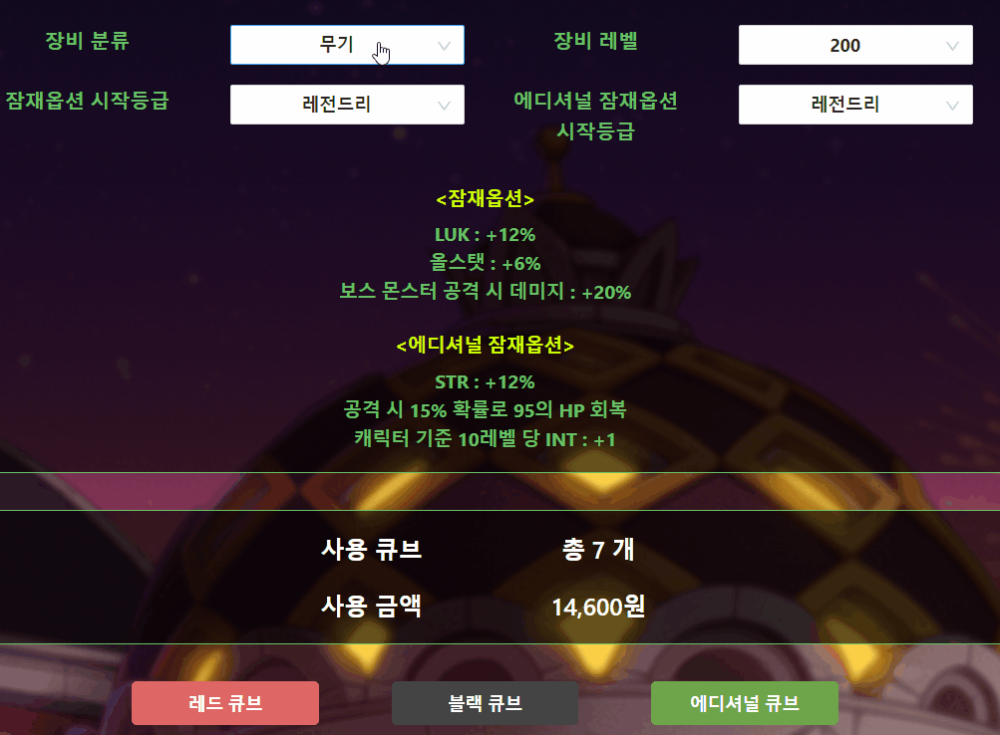
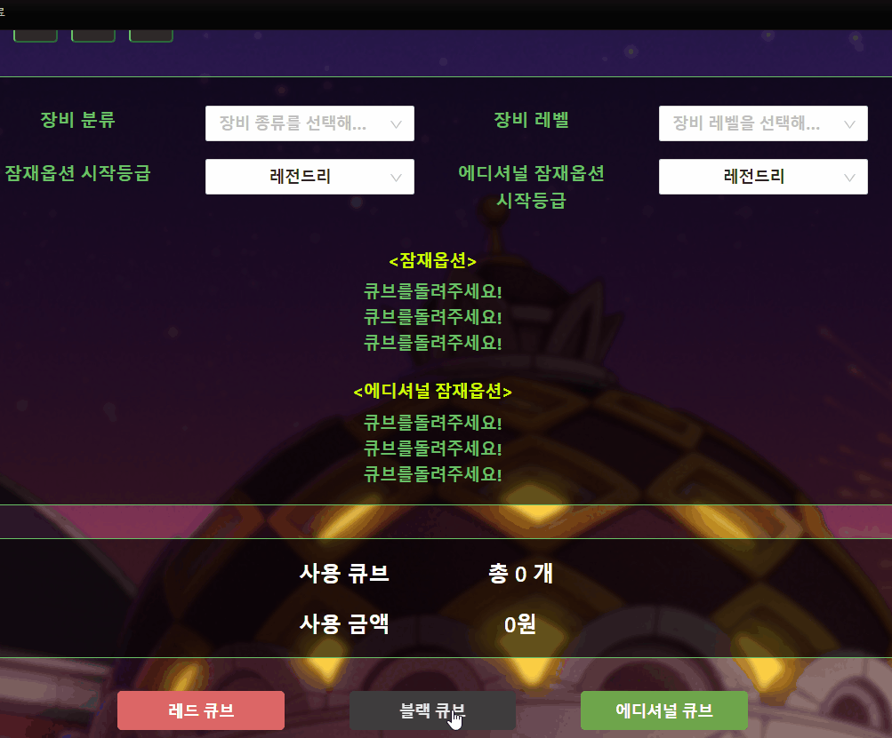

# MapleStory Cube Simulator_clone

> ## Click [here](https://jungpyolee.github.io/maple_cube_simulator_clone/)

 

> 프로젝트 개요

1.  이 프로젝트는 maple.gazua.in/cube 를 반응형으로 클론코딩한 것입니다.
2.  장비 분류와 레벨을 선택 한 뒤 큐브를 클릭하면 잠재옵션이 설정됩니다.
3.  확률은 메이플스토리 공식홈페이지 공개 자료를 참고하였습니다.

 

> 기능 설명

1. 페이지의 너비에따라 레이아웃이 변하도록 반응형으로 제작하였습니다.
 

   

1. 시작등급을 선택하면 옵션의 색이 변합니다.
 

   

1. 큐브 버튼을 클릭하면 각 큐브별로 지정된 확률에 의해 잠재 옵션이 설정되고 사용 큐브 개수와 금액이 설정됩니다.
 

   

1. 장비 분류나 장비 레벨을 변경하면 설정된 잠재 옵션과 사용 큐브 개수, 사용 금액이 초기화됩니다.
 

   

1. 장비 분류와 장비 레벨을 선택하지 않고 큐브 버튼을 클릭 시 안내메시지가 출력됩니다.
 

   
